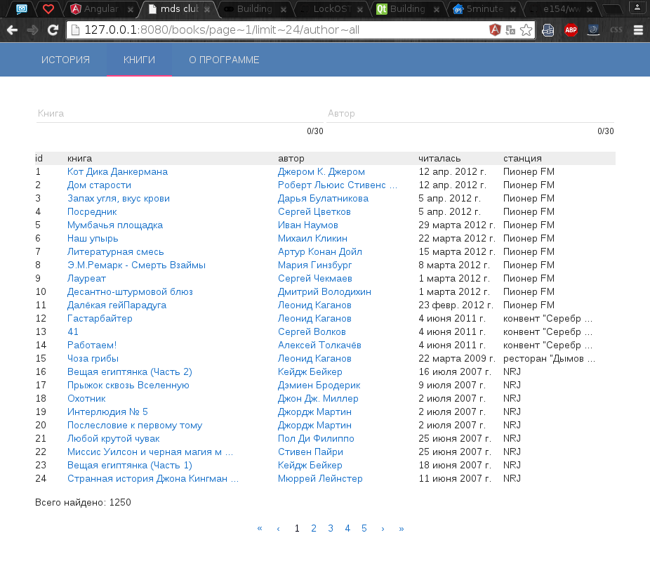

MDS клиент v0.1
---------- 

Эта не большая программа позволяет иметь локальную копию списка аудио книг сайта [mds-club.ru](http://mds-club.ru), 
а так же предоставляет возможность вести историю прослушанных аудиокниг. Удобная форма поиска по авторам, и по названию произведения. 
Данный клиент написан чисто из академического интереса. 


Список книг выбранного автора:


История ранее прослушанных книг:


Список доступных книг, по 24 на страницу:


Удобный проигрыватель, со списком файлов доступных для скачивания:


Присутствует возможность обновить список книг:


#### Сборка из исходников

```bash
git clone git@github.com:e154/mds-club.git
cd mds-club	
make clean && make
```

#### Запуск после сборки

```bash
cd build
./mds
```

на выходе получаем deb пакет, который устанавливаем системным пакетным менеджером.

#### Зависимости

```bash
github.com/PuerkitoBio/goquery
github.com/e154/console
github.com/gorilla/pat
github.com/gorilla/websocket
github.com/mattn/go-sqlite3
golang.org/x/net/html/charset
```

#### LICENSE

mds-club client is licensed under the [MIT License (MIT)](https://github.com/e154/mds-club/blob/master/LICENSE).